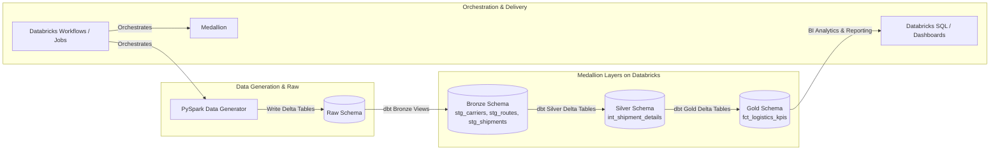

# 🚚 Databricks dbt Logistics Lakehouse

An end-to-end Modern Data Engineering Lakehouse platform built with **Databricks**, **Delta Lake**, and **dbt (data build tool)** following the **Medallion Architecture** (Raw ➔ Bronze ➔ Silver ➔ Gold). 

Orchestrated using **Databricks Workflows (Jobs)** to process batch & streaming logistics operations, carrier KPIs, and transit performance analytics.

---

## 🏛️ Architecture Overview



---

## ⚙️ Tech Stack & Tools

* **Compute & Processing**: Databricks (PySpark & Delta Lake)
* **Data Transformation**: dbt (adapter: `dbt-databricks`)
* **Architecture Pattern**: Medallion Lakehouse Architecture (`raw`, `bronze`, `silver`, `gold`)
* **Data Quality & Testing**: dbt-test (`unique`, `not_null`, `accepted_values`, `relationships`)
* **Orchestration**: Databricks Workflows & Jobs
* **Version Control & CI/CD**: Git, GitHub, Databricks Repos

---

## 📂 Medallion Layer Specifications

| Layer | Schema | Format | Materialization | Description |
| :--- | :--- | :--- | :--- | :--- |
| **Raw** | `raw` | Delta Table | Overwrite / Append | Raw mock logistics data generated by PySpark (Carriers, Routes, Shipments). |
| **Bronze** | `bronze` | View / Delta | View | Staging layer performing initial data casting, timestamps, and column standardization. |
| **Silver** | `silver` | Delta Table | Table / Incremental | Cleansed & enriched layer joining shipments, carriers, and routes with transit day metrics. |
| **Gold** | `gold` | Delta Table | Table | Business-level KPI data mart summarizing revenue, delivery rates, and on-time performance by carrier. |

---

## 🚀 Quick Start Guide

### 1. Prerequisites
* Python 3.9+
* Access to a Databricks Workspace (Community Edition or Paid Cloud Trial)

### 2. Local Setup
Clone the repository and install local dependencies:
```bash
git clone https://github.com/TamBui1704/databricks-dbt-logistics-lakehouse.git
cd databricks-dbt-logistics-lakehouse
pip install -r requirements.txt
```

### 3. Generate Raw Data on Databricks
Run the PySpark notebook [`notebooks/01_generate_raw_data.py`](file:///c:/Users/buith/OneDrive/Desktop/databricks-dbt-logistics-lakehouse/notebooks/01_generate_raw_data.py) inside your Databricks Workspace to populate `raw.raw_carriers`, `raw.raw_routes`, and `raw.raw_shipments`.

### 4. Run dbt Transformations
Configure environment variables or `dbt_project/profiles.yml`:
```bash
cd dbt_project
dbt compile
dbt run
dbt test
```

---

## 📊 Key Logistics Metrics Modeled
* **Delivery Rate (%)**: Percentage of successfully delivered shipments per carrier.
* **On-Time Rate (%)**: Percentage of shipments delivered within estimated transit days.
* **Revenue & Weight Metrics**: Total revenue, average weight per shipment, revenue per kilometer.
* **Carrier Performance Rating**: Aggregate rating and performance breakdown across product types.

---

## 📝 Author
Developed as a production-grade Data Engineering Lakehouse portfolio project by **Tam Bui**.
