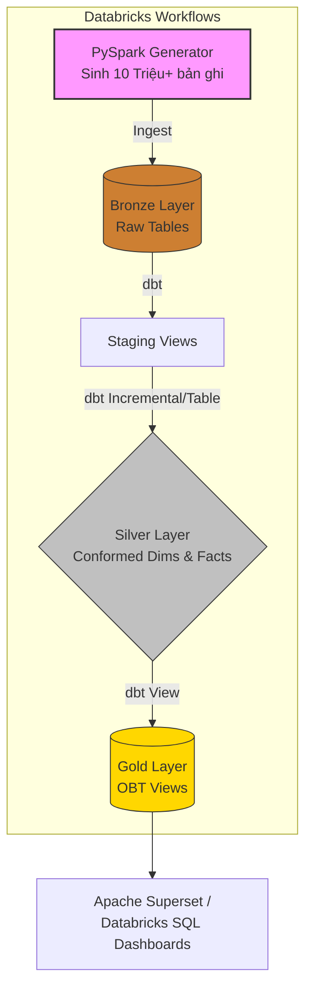

  <h1>🚛 Databricks x dbt: Hệ thống Data Lakehouse Phân tích Lợi nhuận Logistics</h1>
  
Dự án Xây dựng Data Lakehouse trên <b>Databricks Serverless</b> và <b>dbt</b> nhằm giải quyết bài toán "Ảo giác Doanh thu" trong mạng lưới Logistics quy mô lớn.

---

## 📖 Bối cảnh Dự án & Mục tiêu Kinh doanh

Trong một mạng lưới vận chuyển rộng lớn trải dài qua nhiều tỉnh thành, ban lãnh đạo thường gặp phải vấn đề **"Ảo giác Doanh thu"**. Một dịch vụ chuyển phát (ví dụ: Chuyển phát tiêu chuẩn) có thể đem lại doanh thu gộp hàng tỷ đồng, nhưng sau khi trừ đi chi phí vận hành (Cước vận chuyển liên tỉnh, Thù lao công phát tại bưu cục đích), biên lợi nhuận thực tế lại là con số âm.

Dự án này xây dựng một **Ma trận Phân tích Lợi nhuận (Service-Location Profitability Matrix)** từ cấp độ Dữ liệu thô (Raw) lên tới Tầng Báo cáo (Gold), tập trung vào các kết quả phân tích đầu ra chiến lược:

1.  **Phát hiện Điểm "Chảy máu" Lợi nhuận (Profit Leakage):** Nhận diện chính xác các Tuyến đường (Tỉnh gửi $\rightarrow$ Tỉnh nhận) và Dịch vụ đang phải "lấy lãi bù lỗ".
2.  **Đánh giá Hiệu quả Bưu cục (Network Optimization):** Phân tích lượng đơn hàng và thù lao công phát để tìm ra các bưu cục (POS) đang bị quá tải hoặc hoạt động kém hiệu quả.
3.  **Tối ưu Ngân sách Marketing:** Hỗ trợ ra quyết định nên tập trung đẩy mạnh dịch vụ nào, ở tệp khách hàng nào (B2B hay B2C) để tối đa hóa dòng tiền thực tế (Cash-flow).

---

## 🏗️ Kiến trúc Hệ thống & Luồng Dữ liệu

Dự án tuân thủ nghiêm ngặt **Kiến trúc Medallion (Bronze ➔ Silver ➔ Gold)** và Mô hình dữ liệu **Galaxy Schema**. Toàn bộ quá trình ETL/ELT được điều phối tự động thông qua **Databricks Workflows (Jobs)**.

### Chi tiết Mô hình Dữ liệu (Bus Matrix)
*   **Tầng Bronze (Raw):** Chứa dữ liệu gốc được sinh tự động thông qua script PySpark (`raw_customers`, `raw_services`, `raw_pos_locations`, `raw_revenue`, `raw_delivery`).
*   **Tầng Silver (Cleaned & Conformed):** 
    *   **4 Bảng Chiều (Dimensions):** Khách hàng (`dim_customer`), Dịch vụ (`dim_service`), Bưu cục (`dim_pos_location`), Thời gian (`dim_date`).
    *   **2 Bảng Sự kiện (Fact):** Doanh thu thu vào (`fact_revenue`) và Thù lao công phát chi ra (`fact_delivery_remuneration`).
*   **Tầng Gold (Analytics Ready):** Các View tổng hợp (One-Big-Table) đã được JOIN sẵn toàn bộ Fact và Dim (`gold_view_revenue`, `gold_view_delivery`), tối ưu hóa tốc độ truy vấn cho các công cụ Native SQL BI.

---

## ⚡ Điểm nhấn Kỹ thuật (Data Engineering Highlights)

### 1. Phân tích Dữ liệu Chuỗi thời gian Quy mô lớn (10 Triệu+ Bản ghi)
Dự án không sử dụng các file CSV tĩnh nhỏ lẻ, mà tự động sinh ra **hơn 10 triệu bản ghi** dữ liệu giao dịch trải dài trong 3 năm (2024-2026).
*   **Xử lý Phân tán (Distributed Computing):** Thay vì dùng vòng lặp Python, script tận dụng tối đa sức mạnh của Apache Spark với kỹ thuật `explode(array_repeat())`.
*   **Phân phối Dữ liệu Thực tế (Seasonality):** Thuật toán sinh dữ liệu giả lập được thiết kế bám sát thực tế: Lượng đơn hàng tăng cao vào ngày thường (14,000 đơn/ngày) và sụt giảm mạnh vào cuối tuần (Thứ 7, CN).

### 2. Tối ưu hóa dbt (Data Build Tool)
*   **Incremental Loading (Tải tăng dần):** Các bảng Fact lớn mạnh hàng chục triệu dòng được cấu hình chạy `incremental`, chỉ quét và xử lý các bản ghi mới sinh ra trong ngày, giúp tiết kiệm tối đa chi phí Compute của Databricks Serverless.
*   **Materialization Strategy:** Áp dụng Best Practice của dbt: Tầng Bronze sử dụng `View` để tránh nhân đôi dữ liệu vật lý; Tầng Silver sử dụng `Table` để tối ưu hóa hiệu năng phép JOIN; Tầng Gold sử dụng `View` phẳng hóa để phục vụ Dashboard.
*   **Data Quality (Chất lượng Dữ liệu):** Cấu hình chặt chẽ các ràng buộc `unique` và `not_null` cho các khóa chính trong file `schema.yml`.

### 3. Điều phối hoàn toàn trên Cloud
Toàn bộ dự án được thiết kế để triển khai native trên nền tảng Cloud. Việc gọi script sinh dữ liệu và kích hoạt luồng dbt được tự động hóa hoàn toàn thông qua **Databricks Workflows**, đảm bảo luồng dữ liệu (Data Pipeline) chạy trơn tru hàng ngày mà không cần can thiệp thủ công.
